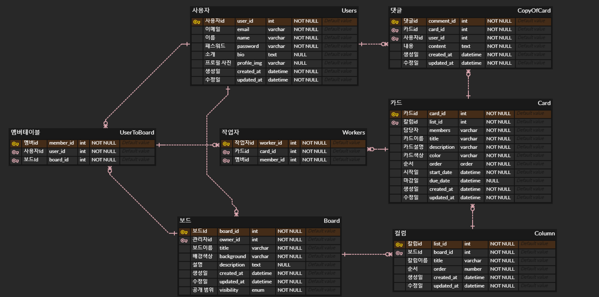
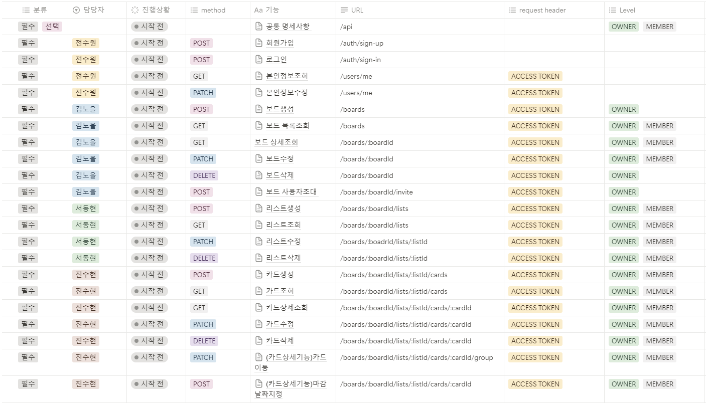

## 기술
<h3 align="center"> BackEnd </h3>

<h3 align="center"> Tools </h3>

## ERD

## API 명세서

## Github Commit Rules
| 작업 타입	| 작업내용 |
|------|------|
| ✨ update | 해당 파일에 새로운 기능이 생김 |
| 🎉 add |	없던 파일을 생성함, 초기 세팅 |
| 🐛 bugfix	| 버그 수정 |
| ♻️ refactor |	코드 리팩토링 |
| 🩹 fix |  수정 |
| 🚚 move	| 파일 옮김/정리 |
| 🔥 del |	기능/파일을 삭제 |
| 🍻 test	| 테스트 코드를 작성 |
| 💄 style	| css |
| 🙈 gitfix	| gitignore 수정 |
| 🔨script	| package.json 변경(npm 설치 등) |